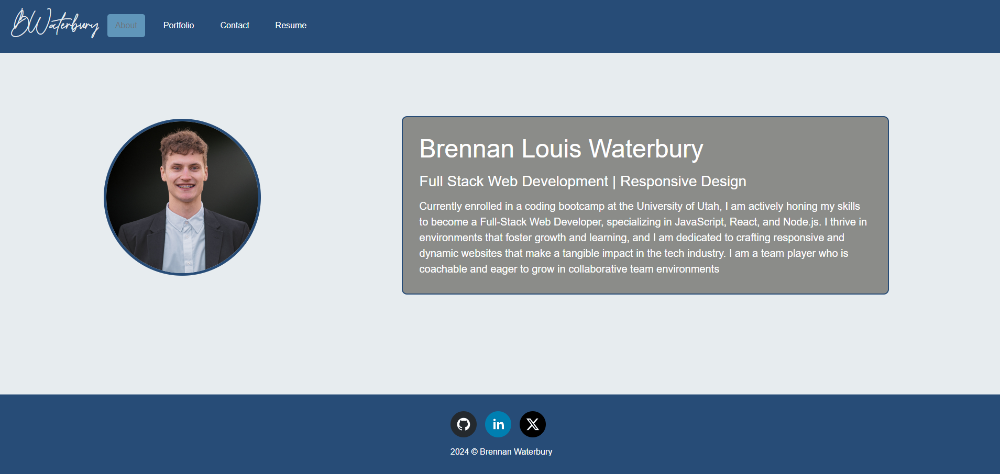
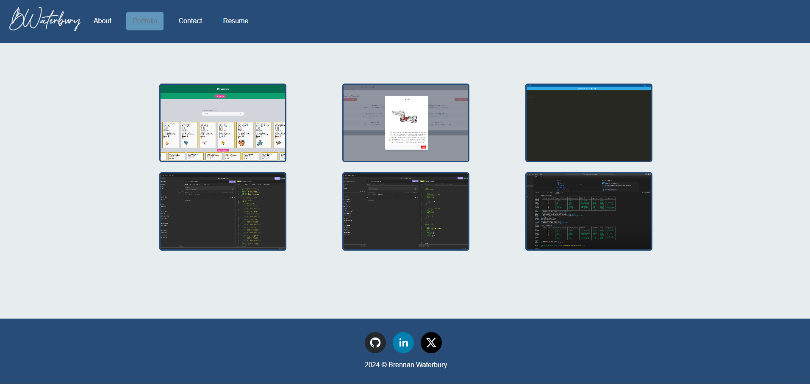
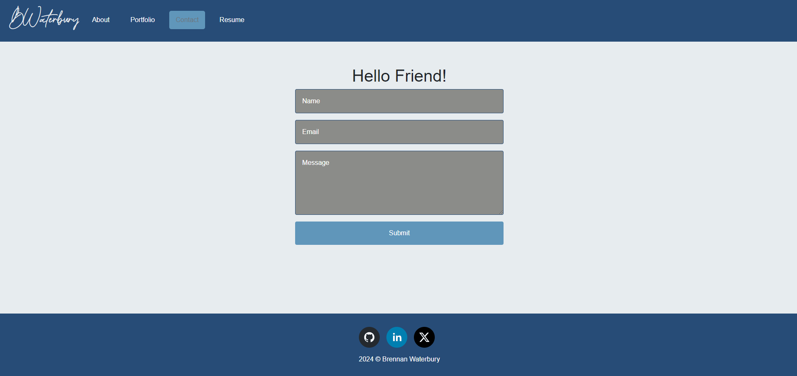
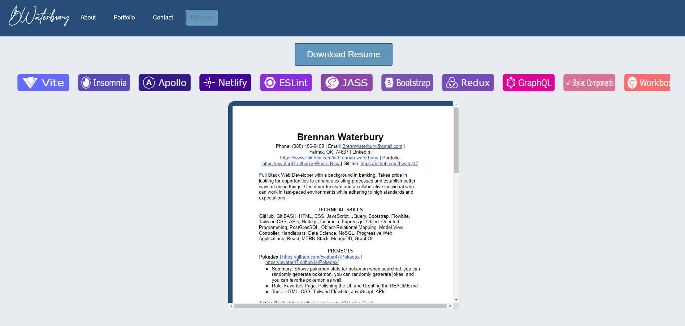

# React-Showcase

-blue>)
-lightblue>)
-red>)

- A portfolio that I can work on with the latest technologies to showcase my skills and projects for employers.

## Description

- <strong>Motivation:</strong> My motivation for building this application was to create a user-friendly and interactive site for my portfolio, aimed at impressing potential employers.
- <strong>Purpose:</strong> This project was built to showcase my skills and projects in a visually appealing and accessible manner, making it easier for employers to evaluate my capabilities.
- <strong>Problem Solved:</strong> This solves the problem of presenting my portfolio in a static, less engaging format, by offering a dynamic and interactive experience.
- <strong>Learning Outcomes:</strong> In this project, I learned how to effectively use React for building interactive UIs, CSS for styling, and HTML for structuring web content.

## Table of Contents (Optional)

Here is a table of contents to make it easy for users to locate which section they need.

- [Installation](#installation)
- [Usage](#usage)
- [Credits](#credits)
- [License](#license)

## Installation

1. Install Required Software:

- GitBash: A command-line interface for Git.
- VS Code: An integrated development environment (IDE).
- Node.js and NPM: A JavaScript runtime and package manager.

2. Clone Your Repository:

- Open GitBash.
- Navigate to the directory where you want to store your project.
- Run git clone <your-repo-url> to clone the repository.

3. Open the Project in VS Code:

- Launch VS Code.
- Open the cloned repository folder.

4. Install Dependencies:

- Open the terminal in VS Code (View > Terminal or `Ctrl + ``).
- Run npm install to install the node_modules packages listed in your package.json.

5. Build and Start the Project:

- Run npm run start to start the server.

## Usage

The React Showcase is for my resume and showcasing my skills with react so that employers will be able to see my best work on my portfolio.

- <strong>React Showcase Link</strong>

- [Website](https://brennan-showcase.netlify.app)

- <strong>React Showcase Screenshots</strong>

- 
- 
- 
- 

## Support

N/A

## Credits

People who worked on this project were Brennan Waterbury. You can contact the contributors through the GitHub profiles links listed here.

- <a href="https://github.com/bwater47" alt="GitHub Link">GitHub Profile - Brennan Waterbury</a>

## License

-
- This is an [https://choosealicense.com/licenses/mit/](https://choosealicense.com/licenses/mit/) license.

## Features

<strong>React Portfolio</strong>: The React-Showcase was created to showcase my skills, and resume using the react language.

## Contributing

Contributing is allowed if you get in contact with me. Contact me by heading to my LinkedIn and shooting me a message otherwise send me an email using my contact form on my portfolio.

- [Contributor Covenant](https://www.contributor-covenant.org/)

## Authors and Acknowledgment

Coolors - the super fast color palettes generator!. Coolors.co. (07/23/24). https://coolors.co/ 

Documentation. EmailJS. (07/23/24). https://www.emailjs.com/docs/

Tutorial V6.25.1. v6.25.1 | React Router. (07/23/24). https://reactrouter.com/en/main/start/tutorial

Quick start. React. (07/23/24). https://react.dev/learn#adding-styles

Getting started. vitejs. (07/23/24). https://vitejs.dev/guide/

NPM docs. npm Docs. (07/23/24). https://docs.npmjs.com/

CLI commands. npm Docs. (07/23/24). https://docs.npmjs.com/cli/v10/commands

Node.js V22.0.0 documentation. Command-line API | Node.js v22.0.0 Documentation. (07/23/24). https://nodejs.org/api/cli.html

MozDevNet. (07/23/24). Resources for developers, by developers. MDN Web Docs. https://developer.mozilla.org/en-US/

Bootcamp Spot. (07/23/24). https://bootcampspot.com/

W3Schools Online Web Tutorials. (07/23/24). https://www.w3schools.com/

Chatgpt. ChatGPT. (07/23/24). https://openai.com/chatgpt

• Please note: While ChatGPT was utilized to generate dialog content for the README file, it was not involved in the generation of any code, HTML edits, CSS edits, or other assets within the repository apart from this README specifically.

• All other sources, links, and information utilized within the project were obtained from the provided sources mentioned in this paragraph. This includes class materials, modules, TA guidance, instructor-provided resources, as well as communication through platforms such as Slack or Discord. Additionally, numerous links and resources were provided within the assignment instructions and demonstrated during class sessions.

## Roadmap

Tests: N/A

## Project status

In-Progress
